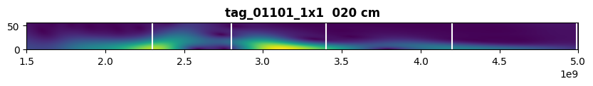

#  Chipless RFID Tag Classification

**Chipless RFID Tag Classification** is a machine learning-based project aimed at classifying RFID tags without embedded chips. Using neural networks, the model analyzes RFID signal patterns to determine their respective categories.

---

## Overview

This project was developed by **Cristina Aparicio González** and **Celia Noguerol Puente**. It focuses on leveraging deep learning techniques to process RFID data, providing accurate classification and improving existing RFID-based identification systems.

The core of this implementation includes:
- Preprocessing RFID signal data.
- Training a neural network models.
- Evaluating models performance and accuracy.

---

## Key Features

### Advanced Machine Learning Pipeline
- **Data Processing**: Converts raw RFID signal data into structured datasets.
- **Neural Network Training**: Implements deep learning models using TensorFlow.
- **Performance Evaluation**: Assesses classification accuracy and suggests improvements.

### Data Preprocessing
- Extracts meaningful features from RFID signals.
- Normalizes and cleans data to enhance model performance.
- Splits datasets into training, validation, and testing sets.

### Neural Network Architecture
- Utilizes **convolutional neural networks (CNN)** for classification.
- Integrates **transfer learning** by fine-tuning pre-trained models:
  - **ResNet50**: Known for deep feature extraction and robustness in image recognition tasks.
  - **EfficientNet**: Optimized for balancing accuracy and computational efficiency.
- Employs activation functions, dropout layers, and batch normalization for optimized performance.

### Model Evaluation
- Computes key metrics such as **accuracy, precision, recall, and F1-score**.
- Visualizes loss curves and classification performance.
- Uses confusion matrices for detailed analysis.

---
## Installation

```bash
git clone https://github.com/cnoguerolpuente/RFID-Tag-Classification
cd RFID-Tag-Classification
python -m venv .venv
source .venv/bin/activate
pip install -r requirements.txt
